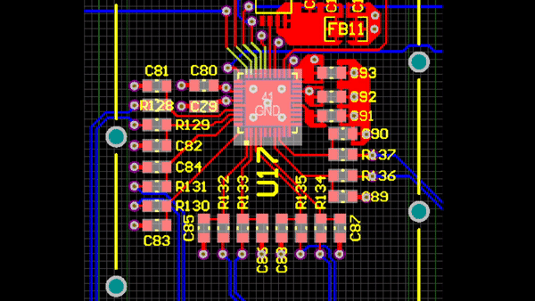
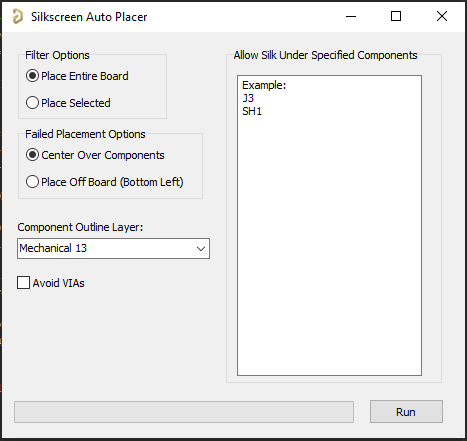

Created By: Stephen Thompson, https://github.com/coffeenmusic

# Auto Place Silkscreen
Iterates through each components' silkscreen reference designator and tries to place it. It will not place over pads, component bodies, or other silkscreen. It will also not place off the board edge. The silkscreen size and width are automatically adjusted depending on the component size. If it can't find a placement, it will try reducing the size. I generally see ~95% placement on boards that aren't dense and ~80% placement on really dense boards (x86).

This script should be a good start for placement, but fine tuning will definitely need to be done after running.

## How to Run
1. Run script from pcb layout. If you want to only place selected components' silkscreen, then select these components (not designators) before running the script.
2. A GUI will open. Select options and run.
3. Any unplaced silkscreen will be placed on top of components by default or may be placed off the board if selected.
4. A popup message box will appear on completion saying how many components were placed and what percentage were placed.

Note: May take a long time to run depending on board size, board density, & speed of computer. It took my PC 15 seconds to place 230 components and about 15 minutes to place 3000 components on a much more dense board. My PC is relatively fast, so your mileage may vary. I would recommend trying to run on selected components first and select a smaller subset to see functionality.

## Options
- Filter Options: Defaults to placing the entire board. Or place selected by selecting the components you want to use & checking the Place Selected radio button.
- Failed Placement Options: By default if placement cannot be found for a particular designator, place in the center of the component. Optionally select the radio button to place off the board which will place designators in the lower left corner off the board.
- Component Outline Layer: Select the mechanical layer that the board uses for component body objects.
- Avoid VIAs: Will try and place designators without placing over vias
- Allow Silk Under Specified Components: Add designator names for components that can have silkscreen underneath them. A shield would be an example of such a component. This text box looks for designators as either comma separated values or on each new line.

## Things to try in future
- Can I use clearance rules? IPCB_SilkToSilkClearanceRule
- Iterate through all good placement positions, use the one with the lowest x/y --> x2/y2 delta square distance. This will slow down execution time.
- Only allow 2 silk designators close to eachother if they are perpendicular to eachother

## Potential Issues
- I've currently only tested on a couple of boards and it works well, but issues may crop up once I've expanded testing.
- Board outline is only approximated as a Bounding Rectangle. Non rectangular boards will probably have issues. \***MIGHT be fixed in AnyAngle update now**\*
- Autoposition behavior is bugged after flipping component to the other side of the board, \***UNTIL THE PCB IS RE-OPENED**\*. It is not recommended to run script after flipping parts to the other side of the board.
- **AnyAngle** placement support has had limited testing, mostly with "Along Pins" rotation strategy.

### Useful Links
- Zoom help: https://www.altium.com/documentation/18.0/display/ADES/PCB_Cmd-Zoom((Zoom))_AD
- Unit conversion functions and more: https://techdocs.altium.com/display/SCRT/PCB+API+Constants+and+Functions#General%20Functions

## How to install and use
_Step 1_: [DOWNLOAD](https://altium-designer-addons.github.io/DownGit/#/home?url=https://github.com/Altium-Designer-addons/scripts-libraries/tree/master/Scripts%20-%20PCB/AutoPlaceSilkscreen) script

_Step 2_: integrate the script into Altium Designer and execute it.\
If you are a newcomer to Altium scripts, [please read the "how to" wiki page](https://github.com/Altium-Designer-addons/scripts-libraries/wiki/HowTo_execute_scripts).
