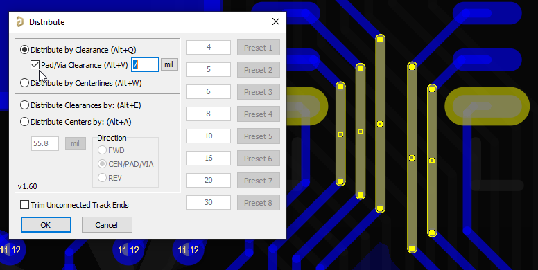

# [DOWNLOAD](https://altium-designer-addons.github.io/DownGit/#/home?url=https://github.com/Altium-Designer-addons/scripts-libraries/tree/master/Scripts%20-%20PCB/Distribute) script

# Distribute Script

## What is it
This script can set the clearance or center-to-center distance between two or more tracks, and in the case of three or more tracks, can distribute the track centers or clearances evenly between the outer pair of tracks.

## How to install and use
_Step 1_: [DOWNLOAD](https://altium-designer-addons.github.io/DownGit/#/home?url=https://github.com/Altium-Designer-addons/scripts-libraries/tree/master/Scripts%20-%20PCB/Distribute) script

_Step 2_: integrate the script into Altium Designer and execute it.\
If you are a newcomer to Altium scripts, [please read the "how to" wiki page](https://github.com/Altium-Designer-addons/scripts-libraries/wiki/HowTo_execute_scripts).

## Usage guide
_Eligible objects_: Select parallel track(s), and up to 2 pads or 2 vias.\
_Invoke script_: - run _`__Start`_ procedure to launch GUI.
### Fast Distribute by Clearances
_`FastDistributeByClearance`_ script procedure can be invoked without GUI to quickly distribute tracks by clearance (equal spacing).
- Supports quickly centering a single track between two pads or two vias.
### Fast Distribute by Centerlines
_`FastDistributeByCenterline`_ script procedure can be invoked without GUI to quickly distribute tracks by their centerlines (equal pitch).
### Distribute by Clearance
_Distribute by Clearance_ will make the clearance distance between all tracks equal, without moving the outer 2 tracks. Requires 3 or more parallel tracks.
### Distribute by Centerlines
_Distribute by Centerlines_ will make pitch of all tracks equal, without moving the outer 2 tracks. If tracks are different widths, they will necessarily have different gaps. Requires 3 or more parallel tracks.
### Distribute Clearances by value
_Distribute Clearances by <value>_ will set the clearance of tracks to the user-specified value, without moving the first track.
### Distribute Centers by value
_Distribute Centers by <value>_ will set the centerlines of tracks to the user-specified pitch, without moving the first track.
### Which one is the First Track?
For the _FWD_ Direction mode, _First Track_ depends on the direction the tracks are running:
* For horizontal tracks, the lowest track is first.
* For vertical tracks, the leftmost track is first.
* For tracks rotated anti-clockwise from vertical, the leftmost track is first.
* For tracks rotated clockwise from vertical, the rightmost track is first.

For the _REV_ Direction mode, the order above is reversed.

For the _CEN/PAD/VIA_ Direction mode, _First Track_ is either the middle track if there are an odd number of tracks, or it is the ***(N/2)***_-th_ track.
- If selection includes 2 pads (that exist on the track layer) or two vias, there is no first track. The center is the midpoint between the pads or vias.

## Features

### Direction of distribution
- _FWD_ behaves as described above, which is the same behavior as previous versions of the script.
- _CEN/PAD/VIA_ redistributes tracks from the midpoint between two vias **OR** from the center of extents. For example, a pair of tracks will move symmetrically or a single track plus two vias will center the track between the vias. The center line is midway between the two selected vias or halfway between the outer pair of tracks' centerlines.
  * **Tip:** stack 2 identical vias on top of each other to force the center to intersect them.
- _REV_ will reverse the direction of distribution i.e. what would normally be the last track is instead the first track.
### Changing Units
When one of the by-value options is active, clicking the "mil" label next to the input value will change it to "MM" and vice versa.
### Presets
When one of the by-value options is active, 8 user preset values are available. Editing a preset value and pressing Enter, or pressing the corresponding button will run the distribute command with that value.
### Trim Unconnected Track Ends
If checked, any unconnected track ends will be trimmed to be perpendicular with the respective end of the _First Track_. Note that since this will lengthen _or_ shorten tracks, you can use this to adjust only the _First Track_ to your desired cut line and the rest will adjust to match it.
### Distributing Tracks Between Pads or Vias
If exactly 2 pads or vias are selected, _`Distribute by Clearance`, `Distribute Clearances by`, and `Distribute Centers by`_ modes will be able to distribute tracks between the pads or vias.
- **Distribute by Clearance**: distributes selected tracks' clearances evenly between the two pads or vias with the specified clearance at the outsides.
- **Distribute Clearances/Centers by <value>** _(CEN/PAD/VIA direction only)_: distributes the selected tracks at the specified dimension between tracks, centering the group between the selected pads or vias.
### Debug Logging
If script is launched using the _StartWithDebug_ procedure, it will save before-and-after data for each track that is distributed.\
Debug file is saved in **`%appdata%\Altium\Altium Designer {installation ID}\DistributeScriptDebug.csv`**

## Examples
### Spreading tracks between pads with fixed pad clearance

  <em>Before</em>
   
  

  <em>GUI Config</em>
   
  

  <em>After</em>
   
  

## Known Issues
### Rounding errors with tracks that aren't at 90/45 angles
Sometimes, particularly when distributing tracks that are not routed at 90° or 45° angles, rounding errors can occur due to precision of double data type and Altium TCoord unit resolution. Errors up to 0.002mil have been observed.
### Tracks that are nearly, but not quite, vertical
Tracks with a slope greater than 20 (90° > angle > ~87.137°) will be coerced to be perfectly vertical. This is a limitation of the Double number type. In short, angles that are too steep will have Y-intercept values that are too large to handle.

## Change log
- 2024-09-24 by Ryan Rutledge : v1.63 - fixed issue with Pad/Via Clearance mode when tracks are different width
- 2024-09-20 by Ryan Rutledge : v1.62 - last-used value now restores Pad/Via Clearance checkbox; added ability to distribute between via & pad combo
- 2023-12-14 by Ryan Rutledge : v1.61 - updated UI to better reflect behavior of distribute evenly versus by fixed distance
- 2023-12-13 by Ryan Rutledge : v1.60 - added support for distributing between pads if they exist on the same layer as track (should match via behavior otherwise)
- 2023-10-23 by Ryan Rutledge : v1.55 - fixed bug with save/load of GUI position
- 2023-07-10 by Ryan Rutledge : v1.54 - after running between-via centering, vias are not deselected; added support for evenly distributing between vias with specific via clearance
- 2023-06-07 by Ryan Rutledge : v1.53 - fixed typo in *SetupDataFromTrack* declaration (didn't seem to be functionally broken though); reformatted function signatures to use more concise and proper Delphi syntax - non-functional change because DelphiScript is untyped, but it's more "correct" now; allow centering between projected drills of vias that don't exist on track layer with user confirmation
- 2023-06-06 by Ryan Rutledge : v1.52 - updated *FastDistributeByClearance* to add support for via centering of single track; fixed typo breaking via centering feature
- 2023-05-25 by Ryan Rutledge : v1.51 - changed List objects to use CreateObject() for implicit garbage collection; changed dialog styles to Altium themed; reorganized functions alphabetically
- 2023-05-12 by Ryan Rutledge : v1.50 - added function prototypes at top with *forward* for future refactor; added location of settings file to *About* info; fixed undefined function error due to function order
- 2023-04-26 by Ryan Rutledge : v1.49 - fixed bug where SetupDataFromTrack would not set "k" for nearly-vertical lines, causing InitialCheck to report lines not parallel; added more detailed debugging messages to InitialCheck.
- 2023-04-21 by Ryan Rutledge : v1.48 - fixed TStringList.Free calls throwing errors if the script did not complete (I think).
- 2023-04-17 by Ryan Rutledge : v1.47 - fixed FastDistribute... functions throwing error when trying to free up TStringList that are only created when running from GUI.
- 2023-04-12 by Ryan Rutledge : v1.46 - made via centering check that tracks are all on the same layer and that both vias exist on that layer.
- 2023-04-11 by Ryan Rutledge : v1.45 - added ability for _CEN_ distribution direction to center track(s) between vias if exactly 2 vias are selected (takes priority over track-derived centerline); fixed redundant move in _CEN_ distribute that could cause coerced middle track to be set to zero length
- 2022-11-18 by Ryan Rutledge : v1.44 - fixed bug where near-vertical tracks wouldn't trim properly if ends were normalized; fixed overflow error for steep angles; fixed invalid distribution if tracks are near vertical and are coerced to vertical
- 2022-11-17 by Ryan Rutledge : v1.43 - added debugging tools; fixed TargetSlope getting reset for each track instead of set once by _First Track_
- 2022-11-17 by Ryan Rutledge : v1.42 - added version to form
- 2022-11-16 by Ryan Rutledge : v1.41 - Added ability to trim dangling track ends perpendicular to _First Track_
- 2022-11-06 by Ryan Rutledge : v1.4 - Remembers last-used distribute mode if valid; added support for distributing tracks by-value in different working directions
- 2022-11-02 by Ryan Rutledge : v1.3 - Added support for up to 8 user presets for by-value inputs; remembers last-used by-value input
