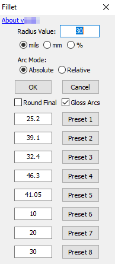
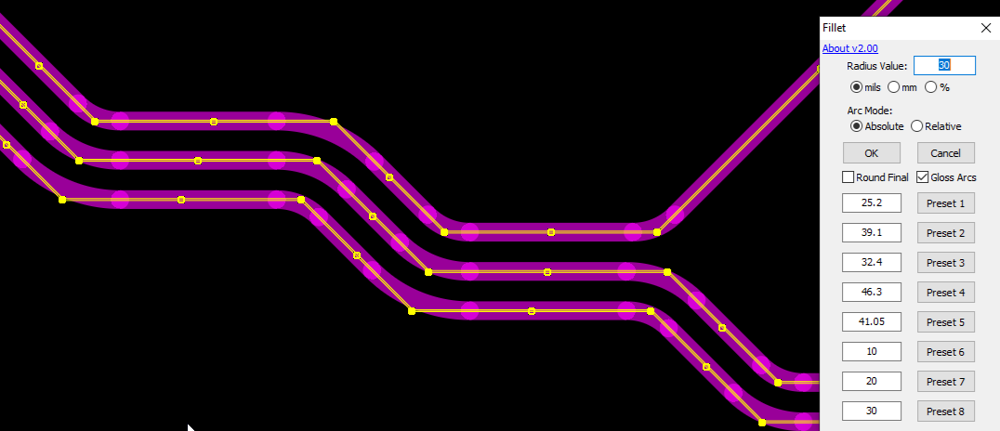

# Fillet Script

# DISCLAIMER
This script is provided "AS IS" in the hopes that it will be useful, but comes with no guarantees or warranties. Use of this script is conditional on accepting it as-is, and the user is responsible for any issues that may arise from its use, including bugs that result in scrap boards. Please thoroughly verify its fitness for your particular use case.

## [DOWNLOAD](https://altium-designer-addons.github.io/DownGit/#/home?url=https://github.com/Altium-Designer-addons/scripts-libraries/tree/master/Scripts+-+PCB/Fillet)

## What This Script Is
This Script creates fillet(s) on selected tracks either as a percentage of the shortest connected track or with fixed radius.

## Credits
Original script created by: Petar Perisin\
Modifications by: Corey Beyer, Brett Miller, and Ryan Rutledge\

## How to install and use
_Step 1_: [DOWNLOAD the script](https://altium-designer-addons.github.io/DownGit/#/home?url=https://github.com/Altium-Designer-addons/scripts-libraries/tree/master/Scripts%20-%20PCB/Fillet)

_Step 2_: integrate the script into Altium Designer and execute it.\
If you are a newcomer to Altium scripts, [please read the "how to" wiki page](https://github.com/Altium-Designer-addons/scripts-libraries/wiki/HowTo_execute_scripts).

## GUI

## Usage guide
_Eligible objects_: intersecting tracks and existing tracks with fillets\
_Ineligible objects_: any non-track or non-arc objects will be deselected when script is launched\
_Invoke script_ `_Start` or `Start` procedure and follow the GUI.

## Features
### Recall Previous Settings
- When GUI is launched, last-used settings will be restored.

### Preset Memory
- Changing the Preset value fields will save them for future runs.
- All inputs are unitless, including presets. This means that a preset _**ONLY**_ changes the Radius value and executes processing.
  - Preset does _**NOT**_ restore the units that were used with it, etc.
  - Change units, arc mode, and other settings before running preset.

### Arc Modes
#### Absolute Arc Mode
- _"mils" or "mm"_ will fillet selected tracks with an arc of the specified radius, *limited by the length of the connected tracks*
- _"%"_ will create a radius that will shorten the shorter of two joined tracks by the indicated percentage. May have unintended behavior when multiple tracks in series are selected.

#### Relative Arc Mode
- when using _"mils" or "mm"_, selected tracks with existing fillets will have their radius modified by the specified radius, up to the limit of the connected track length.
  - Input value must be a non-negative value. "0" will result in existing arcs being removed and tracks left without fillets. Very large values will be internally clamped to not reverse the tracks.
- when using _"%"_, each existing fillet's radius will be scaled by the specified percentage. "50" will halve the radius, "100" will redraw at same radius **(but can be used to trigger Gloss Arcs feature)**, "200" will double the radius.

### Round Final
- Applies rounding to the final arc radius depending on units in use:
  - _"mils"_ : radius will be rounded to the nearest 1 mil
  - _"mm"_ : radius will be rounded to the nearest 0.025 mm
  - _"%"_ : radius will be rounded 1 mil or 0.025 mm depending on the display units in the PcbDoc
- Has interaction with _"Gloss Arcs"_ setting (see below)

### Gloss Arcs
- After performing initial fillet operation with selected settings, added fillets will be evaluated to see if any of them overlap and point the same direction, making them good candidates for making concentric.
- If arcs overlap and point the same direction, adjust radius of each track to make it coincident with the innermost track in the group. Only applicable when filleting multiple parallel tracks, as only arcs added during the script execution will be processed.
- If used in conjunction with _"Round Final"_, rounding will only apply to the innermost fillet, subsequent fillets will prioritize concentricity.
- When used on parallel tracks like differential pairs, this will result in the fillets maintaining the same gap as the parallel tracks. See example below for a single operation.

## Known Issues
### Ratios over about 40% and concentric glossing
- When using concentric glossing, between 40% and 50% ratios the glossing can't work from inside-to-outside, so at 45% it swaps to glossing outside-to-inside.
- High ratio values can get wild, use caution

### Concentric arc search tolerance
- By default, arcs are considered candidates for making concentric if the center point of one is inside the area of the other (the arc sector). Basically if the arc center overlaps ***AT ALL*** and the arcs are pointing the same way, then it will try to make them concentric up to the limit of whatever tracks they have to slide along.
- To make the script much more strict about when arcs are overlapping (as in, the outer arc's center needs to lie in a much smaller "slice" of the inner arc), change the `cSectorAngleDegTol` constant in `Fillet.pas` to a small value in degrees such as `5`.

## TODO?
- allow filleting between a track and arc as a special case when only two objects are selected? Not a good fit for chained lines, but for one-offs it might be handy.

## Change log
- 2023-12-14 by Corey Beyer and Ryan Rutledge : v2.00 - many changes:
  - major refactor of script with more modularity for sanity
  - bug fixes and UX refinements
  - added ability to rebuild tracks with existing fillets
  - added option to change existing arcs relative to their current radius
  - added option to round final radius to nearest 1mil or 0.025mm depending on units in use (ratio uses display units)
  - added option to make fillets added to parallel tracks concentric using inner arc as starting radius (or outer arc as starting radius if using ratio mode >= 45%)
    - Overrides Rounding setting to prioritize concentricity
  - radius values will now be silently clamped to not reverse direction of tracks (for example, a huge radius will be equivalent to using 100% ratio)
  - worked around Altium bug causing undo issues with zero-length tracks (ratio can be 0% and 100% now for no radius and full radius, respectively)
  - changed config file to use ini format for forward compatibility
- 2022-11-08 by Brett Miller : v1.52 - some code cleanup and refactor of TStringList object storage and retrieval, additional safety checking and hiding of sub-functions in RunScript menu
- 2022-11-04 by Ryan Rutledge : v1.51 - input and event handling consolidation, safety checking, and added units and last-used radius to saved settings
- 2022-11-03 by Ryan Rutledge : v1.50 - added preset values with setting saving and made UI less mouse-dependent
- 2018-11-12 by Ryan Rutledge : v1.43 - fixed function being called before definition
- 2018-11-09 by Ryan Rutledge : v1.42 - fixed missing `IsStringANum` function
- 2018-09-16 by Ryan Rutledge : v1.41 - script now deselects ineligible objects at start
- 2018-09-15 by Ryan Rutledge : v1.4 - added support for any-angle tracks and fixed radius
- 2011-10-21 by Petar Perisin : v1.3 - added undo and updated to execute faster
- 2011-09-26 by Petar Perisin : v1.2 - updated fillet script with some extra functionality
- 2011-08-18 by Petar Perisin : v1.00? - initial release to community script repo and hotfix to copy net to created arc
