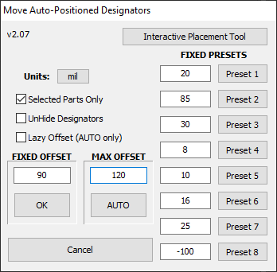

# [DOWNLOAD](https://altium-designer-addons.github.io/DownGit/#/home?url=https://github.com/Altium-Designer-addons/scripts-libraries/tree/master/Scripts%20-%20PCB/MoveAPdesignators2)

# MoveAPdesignators2
This script will change auto-positioned designators to manual and move them by a user-defined amount. Will operate on all or selected components.\
The direction of the movement depends on the current autoposition status.

*Taken from original MoveAPdesignators script*

- Added ability to set justification anchor so that changes to designator size or length grow in the same direction AutoPosition would grow (manual but smarter)
- Added 8 configurable preset values
- Remembers last-used settings
- Negative inputs move designators farther away from component instead of closer
- Works in AD 19+
- Added Automatic movement amount detection
- Added Interactive designator and comment placement modes

## How to install and use
_Step 1_: [DOWNLOAD](https://altium-designer-addons.github.io/DownGit/#/home?url=https://github.com/Altium-Designer-addons/scripts-libraries/tree/master/Scripts%20-%20PCB/MoveAPdesignators2) script

_Step 2_: integrate the script into Altium Designer and execute it.\
If you are a newcomer to Altium scripts, [please read the "how to" wiki page](https://github.com/Altium-Designer-addons/scripts-libraries/wiki/HowTo_execute_scripts).

## Known Issues
- none known at this time

# Features
## Automatic movement amount (GUI)
- Accessed by launching `TweakDesignators` script procedure
- Automatically determines movement by moving it in the autoposition-derived direction until it hits (with some hard-coded clearance constants) a pad, silkscreen line, component body, etc.
## Interactive Designator and Comment placement (no GUI)
- Accessed by launching `InteractivelyAutoposition` script procedure
- Shows instructions in status bar
- After launching, prompts user to click on a component
    - Default behavior is to place Designator
    - Holding CTRL while clicking on the component will place the Comment instead of Designator
- After choosing a component, click in one of the octants around the component to autoposition ithe Designator/Comment n that octant.\
For example: 
    - clicking in the upper-right octant (~45°) will set autoposition to "Right-Above"
    - clicking in the bottom octant (~270°) will set autoposition to "Center-Below"
- After clicking the position location, script will automatically move the Designator/Comment toward the component (within 120 mil) as close as it can while clearing silkscreen, pads, component bodies, etc.
    - Default behavior is to place Designator/Comment with 0° rotation, only taking objects in the parent component into account. Free silkscreen and other components' designators and pads will be ignored.
    - Hold CTRL while clicking the location to NOT ignore objects outside the parent component
    - Hold ALT to place the Designator/Comment at 90° rotation instead.
    - CTRL and ALT can be combined

# Changelog
- 2022-11-28 - Ver 2.0 : Initial release based on MoveAPdesignators scrip Ver 1.2; uses new string justification settings and fixed bug with designator not actually moving coords; added presets and restore last used values
- 2022-11-28 - Ver 2.01 : fixed justification for rotated strings (approximated to nearest 90° rotation)
- 2022-11-28 - Ver 2.02 : *actually* fixed justification for rotated strings (I think)
- 2022-11-28 - Ver 2.03 : ***actually*** *actually* fixed justification and movement for rotated strings (my test PcbDoc was glitched where bottom side designators were mirrored in place or something)
- 2023-02-15 - Ver 2.04 : fixed support for moving designators away with negative input value; maybe, *possibly*, ***actually*** fixed justification and movement for the last time (*found a bug in Altium where components flipped to the other side of the board have the wrong autoposition behavior until the PcbDoc is closed and re-opened.*)
- 2023-06-20 - Ver 2.05 : added support for initially selecting a mix of designators and components, rather than only components; added support for AD19+ AdvanceSnapping text property (might actually fix previous justification bug); better memory safety
- 2023-07-04 - Ver 2.06 : 
    - added automatic movement amount support
    - added command (no GUI) to interactively adjust Designator Autoposition setting for components (with automove)
    - improved clearance detection to use object outlines instead of bounding boxes for most things (better support for objects that aren't at 0/90)
    - reworked configuration file to use .ini file instead, for better forward compatibility
- 2023-07-05 - Ver 2.07 : added button to GUI to start interactive placement tool; added redundant `Start` procedure for users that are accustomed to using that

## Credits
  - Credit to Mattias Ericson & Tony Chilco for the MoveAPdesignators script I started from
  - Credit to Stephen Thompson (@coffeenmusic) for the code I lifted from the AutoPlaceSilkscreen script to get AutoMove working
  - Modified by Ryan Rutledge
