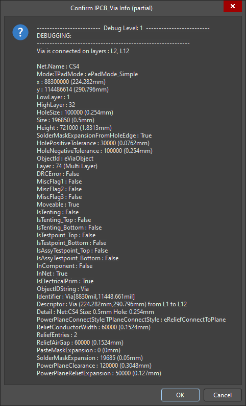
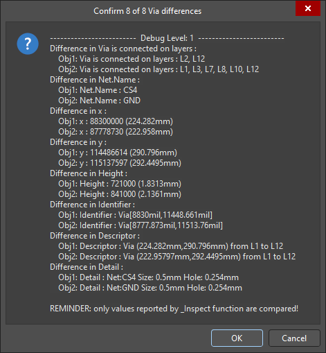

# PCBObjectInspector Script

## [DOWNLOAD](https://altium-designer-addons.github.io/DownGit/#/home?url=https://github.com/Altium-Designer-addons/scripts-libraries/tree/master/Scripts+-+PCB/PCBObjectInspector)

# What This Script Is
This script is a utility tool to help with inspecting PcbDoc objects' underlying properties.

## How to install and use
_Step 1_: [DOWNLOAD](https://altium-designer-addons.github.io/DownGit/#/home?url=https://github.com/Altium-Designer-addons/scripts-libraries/tree/master/Scripts+-+PCB/PCBObjectInspector) script

_Step 2_: integrate the script into Altium Designer and execute it.\
If you are a newcomer to Altium scripts, [please read the "how to" wiki page](https://github.com/Altium-Designer-addons/scripts-libraries/wiki/HowTo_execute_scripts).

_Step 3_: Select objects on the PcbDoc and run `_Inspect` script procedure.

## Examples
#### `_Inspect` Example:

#### `CompareObjects` Example:

## Bonus Functions
- `TurnOffAdvanceSnapping` : Turns **OFF** the `AdvanceSnapping` property of PCB Text strings. For debugging.
- `TurnOnAdvanceSnapping` : Turns **ON** the `AdvanceSnapping` property of PCB Text strings. Can fix certain text snap point and justification issues.
- `MeasureThicknessBetween` : Measures board thickness between two objects on different layers, or between start and stop layers of multilayer pads or vias. Thickness measurement includes thickness of metal layers *between* start and stop layers.
- `LayerStackSummary` : Demonstrates getting a list of all layers from top to bottom in the stackup with a custom formatted summary and the layer objects themselves.
- `Inspect_CallBackHyperlinkText_ZoomPCB` : Demonstrates creating an HTML hyperlink for the selected PCB object(s).
- `CompareObjects` : Compares inspector results between two objects of the same type and shows differences.
- `AreaRatioCalc` : **ONLY WORKS ON REGIONS** Calculates the coverage ratio by area between 2 regions, or between multiple smaller regions and one larger region, such as windowed paste apertures.

## Change log
- 2024-09-18 by Ryan Rutledge : v0.43 - fixed imperial coordinate conversion bug due to typo, and increased resolution to 0.0001 mil (even though many Altium UI elements will only show to 0.001 mil)
- 2024-08-14 by Ryan Rutledge : v0.42 - added function `AreaRatioCalc` to calculate the coverage ratio between 2 or more regions; improved RoundCoordStr() function performance and added benchmarking routine to test it; increased metric rounding precision to 5 digits of precision
- 2024-01-12 by Ryan Rutledge : v0.41 - fixed missing RoundCoords function; added length and width to fill inspector
- 2024-01-11 by Ryan Rutledge : v0.40 - added ability to compare inspector results between two of the same type of object; most Coord values will now also show display unit values (X and Y coordinates are converted relative to board origin); changed to using custom rounding for coordinate to string conversions
- 2024-01-10 by Ryan Rutledge : v0.32 - improved connection checking routine; added demonstration of creating an HTML hyperlink to jump to a PCB object in Altium Designer; added display unit conversion functions with rounding
- 2023-12-21 by Ryan Rutledge : v0.31 - some polishing; added function to measure board thickness between layers; added function to build a list of stackup layer objects from a given start to stop layer
- 2023-12-20 by Ryan Rutledge : v0.30 - fixed some bugs; changed layer numbers to strings; added function to determine the layers a pad or via has wired connections on (working on this for ReturnViaCheck script, but this script makes for easy testing and debugging of utility functions)
- 2023-12-19 by Ryan Rutledge : v0.20 - added ePolyObject, eRegionObject, eComponentBodyObject, and eDimensionObject to inspector
- 2023-12-18 by Ryan Rutledge : v0.11 - added eArcObject, eComponentObject, eFillObject, and ePadObject to inspector; rebuilt track and via messages; changed several integers like pad shape to their enum names
- 2023-12-16 by Ryan Rutledge : v0.10 - initial release supporting eTextObject, eTrackObject, and eViaObject
