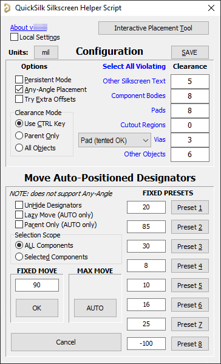
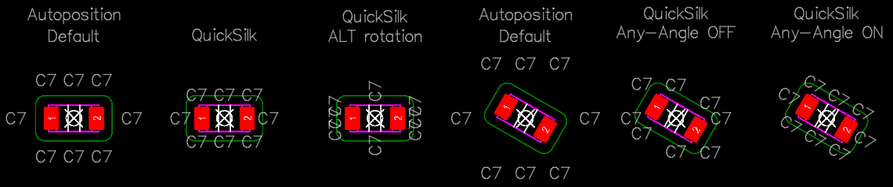

### [DOWNLOAD](https://altium-designer-addons.github.io/DownGit/#/home?url=https://github.com/Altium-Designer-addons/scripts-libraries/tree/master/Scripts%20-%20PCB/QuickSilk)

# QuickSilk
***(formerly MoveAPdesignators2)***

This script is a tool to quickly place silkscreen designators and comments around components.\
Click on the component, then click in the octants around the component to place the designator or comment on that side of the part, following autoposition rules.\
Designator or Comment will be automatically moved closer to the parent component according to configured clearance settings.

Script can also change existing auto-positioned designators (original MoveAPdesignators function with some enhancements) to manual and move them by a user-defined or automatic amount toward their owner component. Will operate on all or selected components.\
The direction of the movement depends on the current autoposition status (Manual and Center autopositions will do nothing).

# Usage Tips
- Script uses status bar to communicate keybindings and what is being modified, I recommend enabling it (View » Status Bar) and making it wider by dragging the separator
- During interactive placement, wait for cursor to change to the pointer finger before picking a component, then wait for it to change to the cross before picking a position.
    - Do not click while the cursor is the hourglass/busy cursor
    - Turning off objects in the selection filter can help avoid hasty clicks "doing" anything
    - Not waiting for the cursor to change/status bar to prompt for next step will likely waste more time than responding to the cursor
    - Automove takes a variable amount of time depending on the surrounding objects it has to check against, so a faster rhythm may fail where a slower rhythm works.
    - Cursor stuck on the hourglass while status is prompting you to select a component means you went too fast

### Configuration/Mass Editing GUI

### Interactive Placement Demo

## Credits
- by Ryan Rutledge
- Credit to Mattias Ericson & Tony Chilco for the original *MoveAPdesignators* script I started from
- Credit to Stephen Thompson (@coffeenmusic) for the excellently-done AutoPlaceSilkscreen script, from which I took the message panel update function and the object overlap code I adapted to get AutoMove working
- Credit to Petar Perisin and Brett Miller for object picking routine I modified from FormatCopy script

## How to install and use
_Step 1_: [DOWNLOAD](https://altium-designer-addons.github.io/DownGit/#/home?url=https://github.com/Altium-Designer-addons/scripts-libraries/tree/master/Scripts%20-%20PCB/QuickSilk) script

_Step 2_: integrate the script into Altium Designer and execute it.\
If you are a newcomer to Altium scripts, [please read the "how to" wiki page](https://github.com/Altium-Designer-addons/scripts-libraries/wiki/HowTo_execute_scripts).

## Known Issues
- **ALTIUM BUG**: When a component is flipped to the other side of the board, autopositioning initially still orients as if it is on the original side. Closing and re-opening the PcbDoc will make the autoposition work properly.
- Placing both designator and comment in the same octant does not currently work because autoposition of the second text ignores the no-longer-autopositioned first text.
- An unlocked component on a different board layer will be picked over a locked component on the current layer due to priority order.
- SpaceNavigator will not work during interactive placement mode if it was started from the GUI.
- Clicking too quickly can register as double-click, script is not mouse-gesture responsive

# Features
## Interactive Designator and Comment placement
- **no GUI, works in 2D and 3D mode**
- Accessed by launching `_QuickSilk` or `InteractivelyAutoposition` script procedure
- Shows instructions in status bar
- After launching, prompts user to click on a component
    - Default behavior is to place Designator
    - Holding CTRL while clicking on the component will place the Comment instead of Designator
- After choosing a component, click in one of the octants around the component to autoposition ithe Designator/Comment n that octant.\
For example: 
    - clicking in the upper-right octant (~45°) will set autoposition to "Right-Above"
    - clicking in the bottom octant (~270°) will set autoposition to "Center-Below"
- After clicking the position location, script will automatically move the Designator/Comment toward the component as close as it can while clearing silkscreen, pads, component bodies, etc.
    - Default behavior is to place Designator/Comment with 0° rotation *relative to the component orientation*, only taking objects in the parent component into account. Free silkscreen and other components' designators and pads will be ignored.
    - **CLEARANCE MODE:** Hold CTRL while clicking the location to NOT ignore objects outside the parent component
        - In this mode, AutoMove will attempt up to 30 mils (in 5mil steps) of nudging in each perpendicular direction to try to find a passing solution
        - Enable modifier key or lock behavior through GUI (will persist even when not launched from GUI)
    - Hold ALT to place the Designator/Comment at 90° rotation instead.
    - Hold ALT and Right-Click to center and hide the Designator/Comment
    - CTRL and ALT can be combined
    
### Interactive Placement Octants
After launching the interactive placement tool and selecting a component, you must click in one of the octants around the chosen component. These octants are 45° wedges arranged around the component that correspond to the general direction of autopositioned designators for a component at 0° rotation.\
The `Any-Angle Placement` configuration option affects whether these octants are at a fixed rotation or whether they match the rotation of the chosen component.
- If `Any-Angle Placement` is **OFF**, the octants have a fixed rotation regardless of component rotation. This will behave closest to the default autoposition behavior, but moving the Designator/Comment text closer to the component.
- If `Any-Angle Placement` is **ON**, the octants are relative to the rotation of the component, and the Designator/Comment will be placed at the same relative rotation and moved closer to the component. This behaves most like rotating the component to 0°, using autoposition, manually moving the text close to the component, then returning the component to its original rotation and normalizing the text direction to be right-reading.

### Interactive Placement Examples
The following are comparisons of default Autoposition placements for a 1206 capacitor footprint rotated at 0° and 30° CW, compared to how QuickSilk places the Designators with `Any-Angle Placement` enabled or disabled:

## Any-Angle Autopositioning
- Enable or Disable through GUI (will persist even when not launched from GUI)
- Only applies to Interactive placement command
- Basically gives you autopositioning of Designators and Comments that aren't limited to angle multiples of 90°
- "Normal" placement will orient the text at 0° relative to the component's zero orientation
- "Orthogonal" placement (ALT key) will orient the text at 90° relative to the component's zero orientation
- Designator/Comment will be normalized to be right-reading after it is manipulated

## Select Violating Designators and Comments
From the GUI, you may click on the clearance labels to select all visible designators or comments that currently violate the configured clearance. Clearance checking behavior is the same as is used for AutoMove
- For example, clicking on "Component Bodies" with a clearance value of 8 mils will select all designators or comments that are within 8 mils of any component body outline (does not follow actual CAD contours, just overall model bounding rectangle)
- Clearance mode is always "All Objects"

## Mass Modification and Configuration GUI
- Accessed by launching `_GUI` or `TweakDesignators` script procedure
- Moves by a fixed or automatically-determined movement amount toward the owner component. Automatic movement works by moving it in the autoposition-derived direction until it hits (with some hard-coded clearance constants) a pad, silkscreen line, component body, etc.

## Interactive Designator and Comment placement and format copying
- **no GUI, works in 2D and 3D mode**
- Accessed by launching `_QuickSilkCopy` or `InteractivelyCopyPosition` script procedure
- Shows instructions in status bar
- After launching script, prompts user to click on a source component
- After choosing a source component, click on a destination component to copy the Designator/Comment placement and formatting from the source to the target.
    - Currently selected source component and its Designator and Comment text (if visible) will be selected
    - Default behavior is to copy the Designator position and formatting *relative to the component orientations of the source and target*
        - For example, if the source component is rotated 0° and the target component is rotated 180°, the Designator will be placed on the opposite side of the part. Use ALT to modify this behavior.
    - Holding CTRL while clicking on the target component will copy the Comment placement and formatting instead
    - Holding ALT while clicking on the target component will copy the Designator/Comment placement absolutely without rotating it relative to component rotation
    - CTRL and ALT can be combined
- **Always normalizes text after manipulation**
- **IMPORTANT**: positioning and rotation are relative to the components' origins, so script works best with component that have the same footprint (or at least the same size and library orientation). Using with mismatched component sizes/orientations it will happily place the text inside or far outside the target component.
- No plans to add a copy mode that only copies formatting without placement - [FormatCopy](https://github.com/Altium-Designer-addons/scripts-libraries/tree/master/Scripts+-+General/FormatCopy) script already does this (and on many more types of objects).
- Side note: script does not clear selection at the start, so you can pre-select components to use as sources, which will be deselected after you have selected each interactively as a source component

# Summary of changes since MoveAPdesignators
- Added ability to set justification anchor so that changes to designator size or length grow in the same direction AutoPosition would grow (manual but smarter)
- Added 8 configurable preset values
- Remembers last-used settings
- Negative inputs move designators farther away from component instead of closer
- Works in AD 19+
- Added Automatic movement amount detection
- Added Interactive designator and comment placement tool
- Added ability to select designators or comments under component bodies, etc.
- Added Interactive designator and comment position and format copy

# Changelog
- 2024-09-06 - QuickSilk Ver 1.21 : updated `InteractivelyCopyPosition` function to also copy visibility setting
- 2024-04-05 - QuickSilk Ver 1.20 : added command for interactively copying designator/comment placement and formatting from source component to destination component(s); hopefully enhanced performance of IsOverlapping check by pre-checking bounding rectangles before using geometric polygons
- 2024-01-22 - QuickSilk Ver 1.13 : fixed needing to run GUI at least once; fixed text normalization to happen before autopositioning
- 2023-12-07 - QuickSilk Ver 1.12 : added nearness-to-click tie-breaker for locked components that have the same bounding area
- 2023-08-01 - QuickSilk Ver 1.11 : fixed bug where first component body found would be ignored
- 2023-08-01 - QuickSilk Ver 1.10 : modified so that "current layer" priority of component picker considers silkscreen layers' side too
- 2023-07-28 - QuickSilk Ver 1.09 : bug fixes, UX improvements, progress bar
    - GUI is no longer modal, allowing you to run clearance checks without starting script multiple times (however, see known 3D mouse issue)
    - added support for via clearance from holes
    - added progress bar for clearance checks (using hacked together functions based on SDK that may be deprecated but I couldn't figure out how to use the StatusBarManager properly - possibly I just didn't know where to grab the right handle)
    - added other utility functions for future use or reference
    - added different handling of locked text in clearance checks
    - fixed All Objects clearance check not including vias
    - made clearance check zoom to selected optional
    - changed area around text to look for violations from fixed 20 mils to whatever clearance rule is that's being checked
- 2023-07-24 - QuickSilk Ver 1.08 : added support for avoiding vias with their own clearance rule
- 2023-07-22 - QuickSilk Ver 1.07 : fixed bug where GUI could run clearance check or automove with stale clearance values from startup
- 2023-07-22 - QuickSilk Ver 1.06 : (GUI enhancement) added ability to select any Designators or Comments that violate a clearance rule; (performance) made AutoMove even more automatic by adjusting search range according to component size
- 2023-07-18 - QuickSilk Ver 1.05 : removed "selected only" from saved settings and instead default to it any time GUI is launched with components selected; added messages when components are skipped because their autopositions are not eligible for moving
- 2023-07-18 - QuickSilk Ver 1.04 : added ability to center and hide Designator/Comment with ALT+RMB; attempted to improve picker responsiveness
- 2023-07-17 - QuickSilk Ver 1.03 : fixed bug in v1.00 that broke Any-Angle OFF placement
- 2023-07-17 - QuickSilk Ver 1.02 : added ability to save settings to script folder
- 2023-07-16 - QuickSilk Ver 1.01 : optimization and polish pass
    - added quicker nudging routine when avoiding all objects (exhaustive search fallback is available as "Try Extra Offsets" config option)
    - added separate clearance mode option for mass AutoMove
    - GUI polish
- 2023-07-14 - QuickSilk Ver 1.00 : Renamed to "QuickSilk"
    - fixed issue where component could be picked if some of its layers were visible (eg silkscreen) even though its copper layer was hidden. Intended behavior is that only components whose COPPER layer is enabled will be selectable.
    - clearance constraints are now configurable through GUI
    - main GUI now includes configuration values
    - improved cursor lag issue
- 2023-07-13 - MoveAPdesignators2 Ver 2.11 : 
    - (interactive placement, when other components NOT ignored) will try up to 30 mils (in 5mil steps) of nudging in each perpendicular direction to try to find a passing solution
    - Cursor will change when picking component, picking location, and when AutoMove is processing
    - Visible grid will be set to 5mil or 0.1mm at start of interactive placement as large grid can mess things up
- 2023-07-11 - MoveAPdesignators2 Ver 2.10 : (Interactive placement) reworked text rotation to be 0° or 90° relative to part rotation (i.e. normal or orthogonal to part, not board); **autoposition now supports any placement angle**
- 2023-07-06 - MoveAPdesignators2 Ver 2.09 : (Interactive placement) added ability to target locked components
- 2023-07-05 - MoveAPdesignators2 Ver 2.08 : fixed issue with interactive placement tool being flipped horizontally for bottom side components
- 2023-07-05 - MoveAPdesignators2 Ver 2.07 : added button to GUI to start interactive placement tool; added redundant `Start` procedure for users that are accustomed to using that
- 2023-07-04 - MoveAPdesignators2 Ver 2.06 : 
    - added automatic movement amount support
    - added command (no GUI) to interactively adjust Designator Autoposition setting for components (with automove)
    - improved clearance detection to use object outlines instead of bounding boxes for most things (better support for objects that aren't at 0/90)
    - reworked configuration file to use .ini file instead, for better forward compatibility
- 2023-06-20 - MoveAPdesignators2 Ver 2.05 : added support for initially selecting a mix of designators and components, rather than only components; added support for AD19+ AdvanceSnapping text property (might actually fix previous justification bug); better memory safety
- 2023-02-15 - MoveAPdesignators2 Ver 2.04 : fixed support for moving designators away with negative input value; maybe, *possibly*, ***actually*** fixed justification and movement for the last time (*found a bug in Altium where components flipped to the other side of the board have the wrong autoposition behavior until the PcbDoc is closed and re-opened.*)
- 2022-11-28 - MoveAPdesignators2 Ver 2.03 : ***actually*** *actually* fixed justification and movement for rotated strings (my test PcbDoc was glitched where bottom side designators were mirrored in place or something)
- 2022-11-28 - MoveAPdesignators2 Ver 2.02 : *actually* fixed justification for rotated strings (I think)
- 2022-11-28 - MoveAPdesignators2 Ver 2.01 : fixed justification for rotated strings (approximated to nearest 90° rotation)
- 2022-11-28 - MoveAPdesignators2 Ver 2.0 : Initial release based on MoveAPdesignators scrip Ver 1.2; uses new string justification settings and fixed bug with designator not actually moving coords; added presets and restore last used values

### Planned features?
- Add violating objects to messages panel with ability to jump to?
- If initial placement of designator or comment interferes with the other (and text justification implies that it was interactively positioned), infer that both are trying to be autopositioned in the same octant and autoposition both before moving each
- Support any-angle placement on mass edit by taking current autoposition, mapping to an octant, then running positioning using that
- Should I get rid of Any-Angle Placement OFF support?
