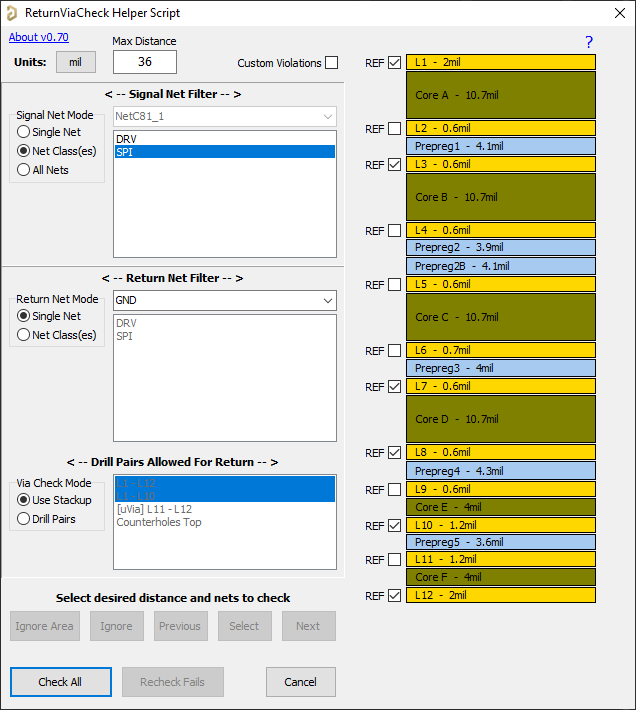

# ReturnViaCheck Script

# DISCLAIMER
This script is provided "AS IS" in the hopes that it will be useful, but comes with no guarantees or warranties. Use of this script is conditional on accepting it as-is, and the user is responsible for any issues that may arise from its use, including failure to detect a critical problem that results in scrap boards. Please thoroughly verify its fitness for your particular use case.

## [DOWNLOAD](https://altium-designer-addons.github.io/DownGit/#/home?url=https://github.com/Altium-Designer-addons/scripts-libraries/tree/master/Scripts+-+PCB/ReturnViaCheck)

# What This Script Is
This script is a utility tool to help detect high-speed signal vias without a nearby return via.

## Why?
When a high-speed (or RF) signal's route changes layers, the reference plane for the signal also changes. Just as the incident signal requires a via to change layers, so too does the "return" signal need a path between reference planes.

## How to install and use
_Step 1_: [DOWNLOAD](https://altium-designer-addons.github.io/DownGit/#/home?url=https://github.com/Altium-Designer-addons/scripts-libraries/tree/master/Scripts+-+PCB/ReturnViaCheck) script

_Step 2_: integrate the script into Altium Designer and execute it.\
If you are a newcomer to Altium scripts, [please read the "how to" wiki page](https://github.com/Altium-Designer-addons/scripts-libraries/wiki/HowTo_execute_scripts).

## Usage guide
### USE THE GUI
- Accessed by launching `_GUI` script procedure

### Configuration/Editing GUI

### **ENABLE VIAS IN SELECTION FILTER**
Script will detect if this is not the case.

## Features
### Stackup-Based Via Connection Checking
- User tags Reference layers in stackup visualization
- Each layer will have up to 2 reference layers:
  - First reference layer will be the nearest layer tagged as REF, regardless of distance or of any intervening layers (user may have intervening layers cut away or not actually routed)
  - Second reference layer will be the nearest layer **on the opposite side** from the first reference layer, **IF** it is within 2X the first reference layer's distance from signal layer.
    - 2X factor is the default value but can be configured by text-editing the configuration file (click version number in GUI to view path to config file)
    - 2X factor is based on the fact that coupling will be dominantly to the closer layer (first reference). For an example, a 50 ohm unbalanced stripline's impedance changes by <1% when when the farther reference layer changes from 2X to 2.1X distance:

- If connected signal layers share a single common reference layer, no via is necessary. Example: L2 is reference, L1 and L3 both only reference L2, and signal via is only connected on L1 and L3.
- Click on `?` to see how reference layers have been interpreted based on user's REF tags and stackup thicknesses:

- When a layer is considered "Connected":
  - Via exists on that layer (has a pad larger than drill hole) and has a track, arc, region, fill, polygon, or pad connected to it
  - Via has a plane connection on that layer
### Recall Previous Selections
When GUI is launched, selections from previous check will be restored. Net/Class/Drill Pair/Layer names must match exactly else defaults will be used. Works best between checks on the same board.
### Filter Signal & Return Vias
- Filter signal vias by net or net class
- Filter return vias by net or net class
- Filter return vias by Drill Pair
### Failed Vias Added to Messages Panel
Failed vias will be listed in Messages panel. These messages can be used to jump to specific vias.
### Custom Violations
- Check the `Custom Violations` box in the GUI to add (somewhat) custom violations for failed vias
- If `Custom Violations` is **ENABLED**, via return checks will modify the PcbDoc to add and remove custom rules and violations
- Custom violations use the Hole To Hole violations formatting (you will see violations like "Hole To Hole Clearance Constraint: (Collision < 35 mil)...") for failing vias
- This turns on DRC violation overlay for those vias and allows navigating them with the PCB Rules And Violations panel
- If not used, failed vias will only be highlighted and selected

## Eligible Objects
Vias

## Known Issues
### Return via drill pair eligibility
- Defaults to full-stack at start, but user can select other drill pairs in the layer stack to consider.
- In `Drill Pairs` Via Check Mode, return via drill pair eligibility is not validated i.e. user can select drill pairs that aren't _**actually**_ going to provide a return path - the script will still treat them as valid returns if they are close enough.

## Change log
- 2024-02-07 by Ryan Rutledge : v0.75 - fixed missing sLineBreak2 constant definition
- 2024-01-10 by Ryan Rutledge : v0.74 - polished up highlighting UX when failures are ignored; plane connection check performance improvement; recognize connection in cases where padless hole is flooded with a solid polygon pour (not a full annular ring check)
- 2024-01-03 by Ryan Rutledge : v0.73 - changed metric unit strings from truncated 0.01mm to rounded 0.0001mm resolution; improved Messages so the PcbDoc is shown if not visible; made Messages zoom to fixed expansion rather than proportional to object size
- 2024-01-03 by Ryan Rutledge : v0.72 - minor improvement to layer stackup help button info; skip compiling reference layers when not using stackup checking
- 2024-01-02 by Ryan Rutledge : v0.71 - fixed bug with second reference layer not being properly checked and another possible bug
- 2024-01-02 by Ryan Rutledge : v0.70 - changed config settings to remember last 10 board stackup reference layer assignments (by file name); fixed stackup getting slightly cut off
- 2023-12-28 by Ryan Rutledge : v0.61 - made second reference distance ratio configurable in settings file; minor UX polish
- 2023-12-25 by Ryan Rutledge : v0.60 - new feature: optional stackup-based reference connection checking; UX polish
- 2023-12-16 by Ryan Rutledge : v0.50 - added optional custom DRC violations; now highlights failed vias; more safety checks
- 2023-12-05 by Ryan Rutledge : v0.41 - added button to ignore all failed vias touching an area
- 2023-12-04 by Ryan Rutledge : v0.40 - recall selections from previous check when launching script, added progress indicators
- 2023-12-01 by Ryan Rutledge : v0.31 - "Recheck Fails" re-selects and zooms all failed vias; harmonized messages and selection behavior between "check all" and "recheck failed"; minor UX tweaks
- 2023-11-30 by Ryan Rutledge : v0.30 - added ability to select drill pairs other than full-stack
- 2023-11-29 by Ryan Rutledge : v0.20 - now adds message to messages panel for each failed via detected
- 2023-11-24 by Ryan Rutledge : v0.11 - some UI cleanup
- 2023-11-22 by Ryan Rutledge : v0.10 - Initial proof of concept script and requirement musings

# INITIAL REQUIREMENTS SPEC
## Non-Modal GUI
- [x] Non-modal so that findings can be addressed without restarting the script (better UX)
## Configurable check distance
- [x] If any eligible return via exists within range, via passes check
- [x] If no eligible return via exists within range, add signal via to a list of vias that failed check
- [x] Support either metric or imperial units
## Other potential filter criteria? - SUBMIT AN ISSUE if you strongly want one of these
- [ ] Filter by min >< max via hole size?
- [ ] Filter signal via by separate drill pair list?
- [ ] Filter by what the via is connected to (track/pad/region)?
- [ ] Filter by hole type (via/pad)?
## Filter vias by Specific Net, Net Class, or All Nets
- [x] Options to signal return vias by All Nets, Specific Net, or Net Class
- [x] Options to filter return vias by Specific Net or by Net Class (not all nets)
- [x] Option to filter return vias by Drill Pair
- [x] Multiselection only for net classes because of likelihood of huge count of individual nets
- [x] Selected return nets are ignored
- [x] Ignore unconnected via layers
- [ ] should through-hole pads be considered? I'm leaning toward no but maybe this has value?
## Issues to do with stackups and drill pairs
- [x] `Use Stackup` Via Check Mode should analyze actual via connections to verify that the used signal layers' references are connected together
## Dedicated list of nets to exclude?
- [ ] Same potential multiselection problem as above (would probably only make sense to allow selecting net classes to excludes)
## Save states between runs
- [x] Lists of nets/classes could be challenging - looks for exact match from last check
- [x] Needs to not break if netlist changes (eg. with different board or just a netlist change) - will only restore if all saved values exist
- [x] Would be nice to save state for a few "recent" boards
## Buttons to Check All, Recheck, and Clear Results
- [x] Check All button: checks all vias. After clicking, selected filter settings are locked until clear results button is used
- [x] Recheck button: (for performance reasons) only repeats check on vias in failed via list. If any now pass, list will be updated
- [x] Clear Results button: Implemented as "Check All" changing to "Restart"; clears failed via list and unlocks selection filters again
## Zoom to failing vias button?
- [ ] Clears selection, selects all failing vias, zooms to selection, then clears selection again
## "Next" and "Previous" buttons to step through the list of failed vias
- [x] Only active while list of fails is not empty
- [x] There should be a button to ignore via that removes via from list of fails as if it were rechecked and passed
- [x] There should also be a button to "Zoom" on and select the current via from the list in case user pans away
