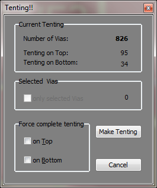

# TentingVias
Script with GUI to make all vias tenting or remove tenting from all vias. It does also work on selected vias only.

## Changelog
Version 1.1: Improved tenting function for when only some vias are selected.
Version 1.2: Fixed display update, set soldermask expansion mode to allow tenting.

## Credits
Author:   cyril@andreatta.ch
Modified: BL Miller 
